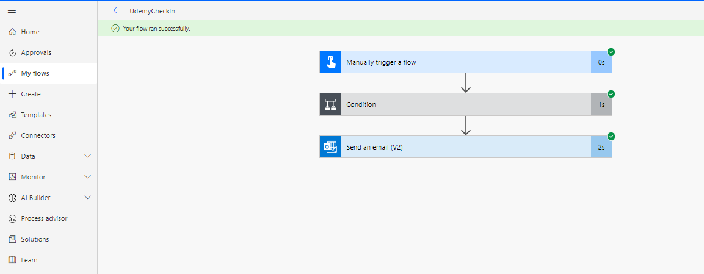

# Employee Check in Button (Power Automate Project)
## Introduction
Automating Employee Check-in
 In most organizations, you have to fill a log book when checking in and checking out, This data is not digitized, Organizations don’t use it unless there is a need for them to use it, and if you look at the recorded for 3,4 or 5 years back, they are either torn, lost or incomplete.
To get the best from data you need to digitize them, using this approach (Employee check-in button with Power Automate), the data gets digitized, so you can keep track of employees’ productivity, as to when they are checking in and checking out. You can make policies and track how that policy is taking effect on logging in and logging out activities. This allows you to ask questions because you have the data in a digital form, thus making it easy to analyze. 

## Solution Overview
A Power Automate flow was created to allow employees automatically check in and check out, the time as at when they do so is also automatically recorded,their current body temperature is also taken and recorded,as an added measure as per the covid-19 guidelines.

## Some of the services used are,
-	SharePoint List, to store the data.
-	Power Automate as a frontend
-	MS Outlook for sending mail.

## Power Automate Flow Overview

